<div align="center">



</div>

---

<div align="center">

```
"First, solve the problem. Then, write the code."
```

</div>

---

<br>

## ﹏ about me

```javascript
const jamillySantos = {
  focus:      "Front-end Development",
  studying:   "Back-end Development",
  exploring:  "Data Engineering",
  status:     "always learning...",
}
```

<br>

## ﹏ stack

<div align="center">


</div>

<br>

## ﹏ also exploring

<div align="center">


</div>

<br>

## ﹏ in progress

```
Front-end       ████████████░░░░  75%  ✦
Back-end        █████░░░░░░░░░░░  30%  ✦  studying...
Data Eng.       ███████░░░░░░░░░  40%  ✦
```

<br>

## ﹏ featured projects

| repository | description |
|------------|-------------|
| [📁 javascript-if-else](https://github.com/santhxyy/javascript-if-else) | practical guide on javascript conditionals |
| 📁 coming soon... | back-end project 🔧 |
| 📁 coming soon... | data engineering project 🔧 |

<br>

## ﹏ community

> 💬 I'm part of **ByteCore** — a programming community on Discord.
>
> *"Hi, I'm **Jamilly Santos** — a dev in constant evolution!"* 🖤
>
> [](https://discord.gg/dxD9NsnHy)

<br>

## ﹏ statistics

<div align="center">


</div>

<br>

---

<div align="center">

*thanks for visiting* ◦ *leave a ⭐ if you like my work*

</div>
